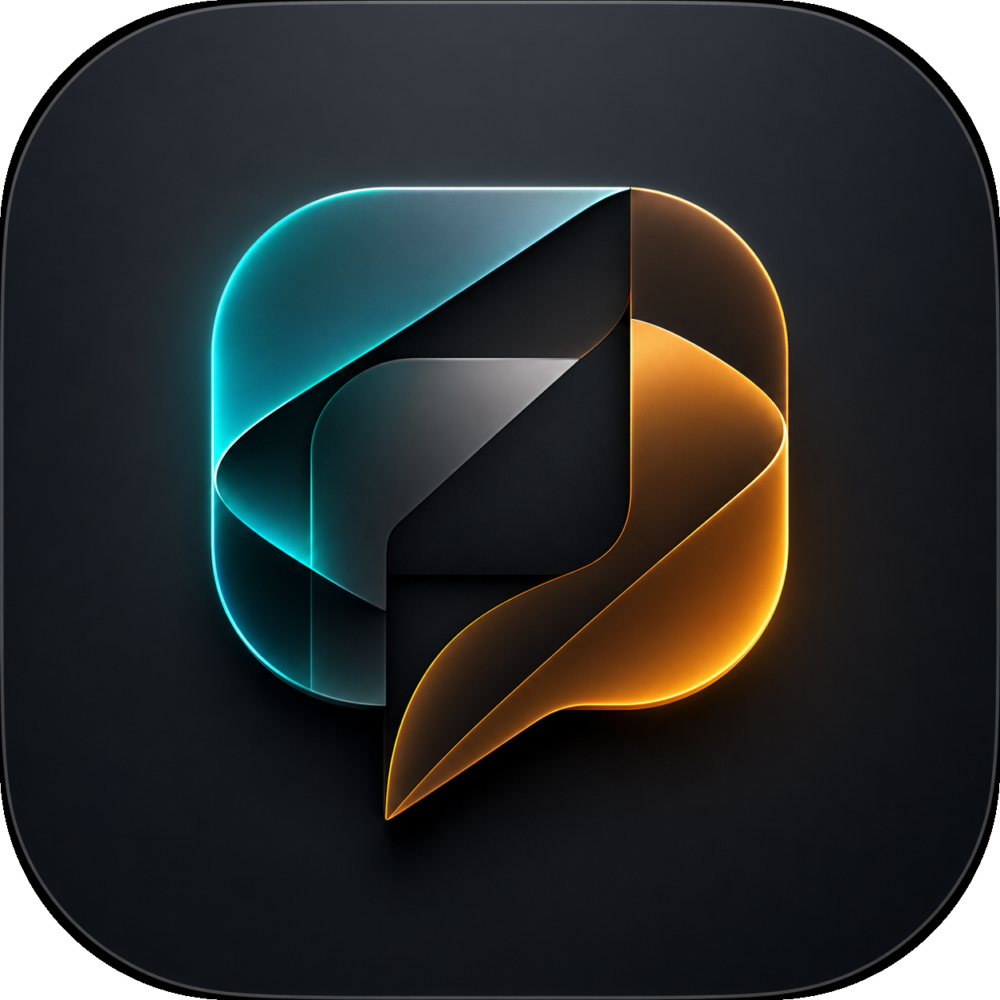

<p align="center">
  
</p>

<h1 align="center">translate&go</h1>

<p align="center">
  <strong>Langue :</strong> <a href="README.md">EN</a> | <a href="README.ru.md">RU</a> | FR
</p>

<p align="center">
  <strong>traduction locale du texte avec un seul raccourci</strong>
</p>

<p align="center">
  
  
  
  
  
</p>

`translate&go` est une petite application macOS qui traduit le texte sélectionné avec un modèle Ollama local. Sélectionnez du texte dans n'importe quelle application, appuyez sur votre raccourci, puis collez la traduction depuis le presse-papiers.

## Fonctionnalités

- raccourci global pour traduire le texte sélectionné
- traduction locale avec Ollama
- réglages du modèle, de la langue cible, de la langue de l'interface, du Dock et de la barre de menus
- interface en anglais par défaut, avec le russe disponible dans les réglages
- fenêtres de réglages et de questions-réponses

## Installation

1. Téléchargez et ouvrez `translate-go.dmg`.
2. Glissez `translate&go.app` dans `Applications`.
3. Ouvrez l'application depuis `Applications`.
4. Si macOS bloque l'application parce qu'elle n'est pas certifiée par Apple, exécutez :

```bash
sudo xattr -rd com.apple.quarantine "/Applications/translate&go.app"
```

5. Ouvrez de nouveau l'application et autorisez l'accès Accessibility quand macOS le demande.
6. Facultatif : installez Homebrew si vous ne l'avez pas déjà :

```bash
/bin/bash -c "$(curl -fsSL https://raw.githubusercontent.com/Homebrew/install/HEAD/install.sh)"
```

7. Installez Ollama. Si Ollama est déjà installé, ignorez cette étape :

```bash
brew install ollama
```

8. Téléchargez un modèle de traduction :

```bash
ollama pull translategemma:12b
```

9. Ouvrez les réglages, choisissez le modèle, la langue cible, la langue de l'interface et le raccourci.

## Autorisations

Activez `translate&go` ici :

```text
System Settings -> Privacy & Security -> Accessibility
```

Cette autorisation permet à l'application de copier le texte sélectionné avec `Command-C`.

## Utilisation

1. Sélectionnez du texte dans n'importe quelle application macOS.
2. Appuyez sur le raccourci configuré.
3. Attendez que la traduction soit copiée dans le presse-papiers.
4. Collez le résultat avec `Command-V`.

## Licence

BSD 3-Clause. Voir [LICENSE](LICENSE).
